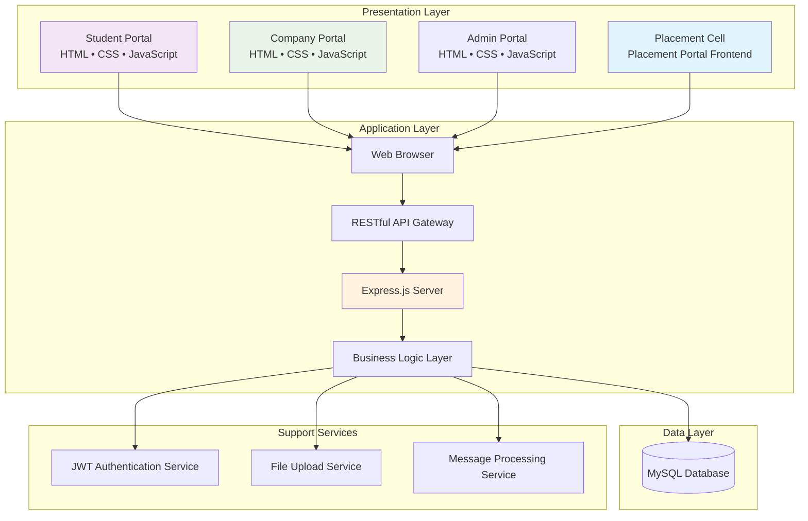
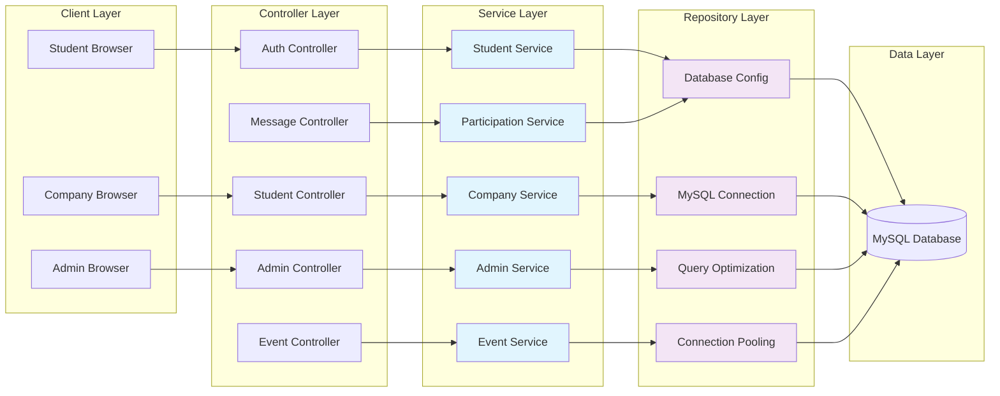
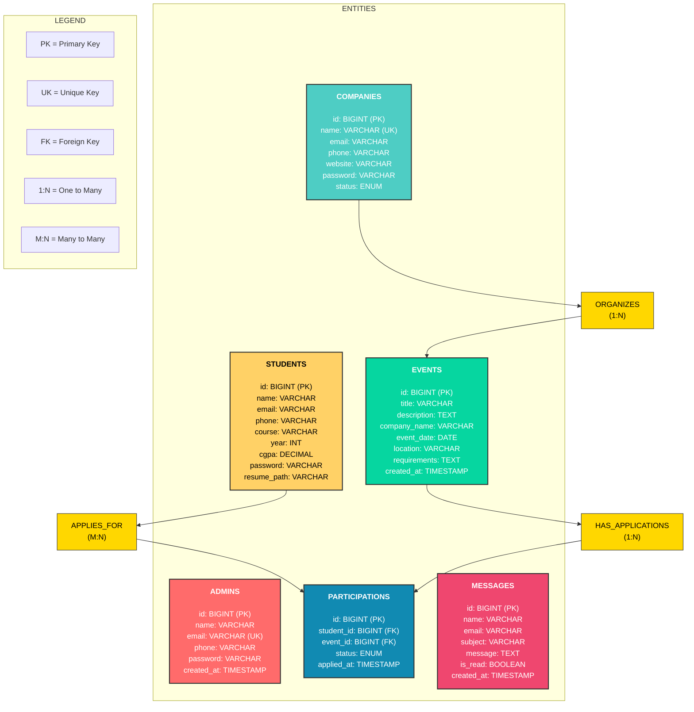
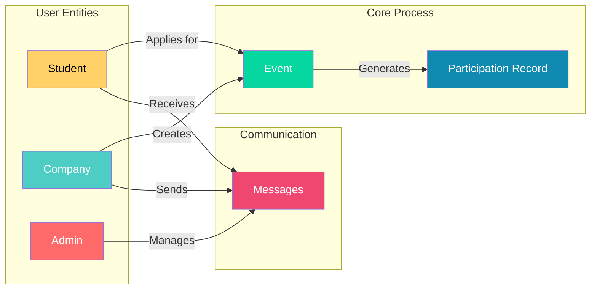

# 🎓 GEHU Placement Portal — Advanced Campus Placement Management System

<p align="center">
  🚀 A comprehensive Node.js web application that automates and streamlines the entire campus placement process, eliminating manual coordination through a centralized platform for students, companies, and administrators.
</p>

<p align="center">
  
  
  
  
  
  
  
</p>

<br>

---

## 📖 Problem Statement
The conventional campus placement system suffers from significant inefficiencies due to its reliance on fragmented, manual processes:

### Communication Bottlenecks
- **Email Overload**: Placement cells exchange 100+ emails per company, creating communication chaos and missed information
- **Information Delays**: Critical updates about tests, interviews, and results take days to reach all stakeholders
- **Platform Fragmentation**: Communication happens across emails, WhatsApp, phone calls, and physical notice boards

### Administrative Overhead
- **Data Duplication**: Students re-enter identical information across multiple Google Forms for different companies
- **Time Consumption**: Placement officers spend 60-70% of their time on administrative coordination rather than strategy
- **Manual Processes**: Every placement drive requires creating new forms, spreadsheets, and communication templates

### Data Management Challenges
- **Siloed Information**: Student data resides in separate Excel sheets, email attachments, and paper records
- **Error-Prone Updates**: Manual data entry leads to incorrect eligibility lists and missed opportunities
- **Poor Analytics**: No centralized system to track placement trends, success rates, or student performance

### Process Inefficiencies
- **Limited Scalability**: Manual systems struggle to handle multiple placement drives simultaneously
- **Repetitive Work**: The same administrative tasks repeat for every company visit
- **Compliance Risks**: Manual processes increase chances of errors in critical placement documentation

These inefficiencies result in delayed placements, reduced company participation, student frustration, and suboptimal placement outcomes that directly impact institutional reputation and student career prospects.

<br>

---

## 💡 Our Solution
GEHU Placement Portal revolutionizes campus recruitment by providing an integrated, automated platform that eliminates fragmentation and manual inefficiencies. Our solution delivers:

### **For Students: Comprehensive Career Management**
- **Single-Source Profile Management**: Create and maintain one comprehensive profile accessible to all incoming recruiters.
- **Intelligent Event Discovery**: Single click apply option for matching placement drives based on eligibility, interests, and skills.
- **Real-time Application Tracking**: Monitor application status from registration to final selection.
- **Resume Management**: Secure resume upload and storage functionality.

### **For Companies: Streamlined Recruitment Operations**
- **Simplified Registration**: Single-point registration with approval workflow and verification.
- **Targeted Job Postings**: Create detailed position descriptions with specific eligibility criteria.
- **Smart Candidate Filtering**: Advanced shortlisting based on CGPA, skills, department, and other parameters.
- **Smart Scheduling**: Schedule assessments and interviews efficiently.
- **Compliance Management**: Ensure adherence to institutional placement policies and procedures.

### **For Administrators: Centralized Placement Governance**
- **Complete User Management**: Approve, monitor, and manage all student and company accounts.
- **Event Orchestration**: End-to-end coordination of placement drives from announcement to completion.
- **Policy Enforcement**: Configure and enforce institutional placement rules and eligibility criteria.
- **Student Management**: Management of students with various placement related metrics.

### **Enterprise-Grade Operations Management**
- **Bulk Data Processing**: Excel/CSV import/export for student registrations, company data, and event management
- **Role-Based Messaging**: Secure communication channels between companies and administrators
- **Audit Trail**: Complete logging of all communications and transactions for transparency and compliance
- **Modern Technology Stack**: Built with Node.js, Express.js, MySQL, and responsive frontend technologies
- **Security First**: Role-based access control, data encryption, and secure authentication
- **API-First Design**: RESTful APIs enabling future integrations with HR systems and educational platforms

This holistic solution transforms campus placement from a fragmented, manual process into a streamlined, automated ecosystem where technology enhances human potential rather than complicating it.

<br>

---

## 🏗️ System Architecture

GEHU Placement Portal follows a modern **three-tier architecture** with clear separation of concerns, ensuring scalability, maintainability, and security.

### 🎯 High-Level Architecture Diagram



<p align="center">
  <b>Figure 1: High-level system architecture showing interaction between presentation, application, and data layers</b>
</p>

<br>

### 🔄 Detailed Service Architecture



<p align="center">
  <b>Figure 2: Detailed service architecture showing modular design and database connectivity</b>
</p>

<br>

---

## 🗄️ About The Database

GEHU Placement Portal follows a traditional *RDBMS* (Relational database schema), implemented with *MySQL* having multiple entities participating in relationships for ensuring scalability, maintainability, and security.

### 🎯 VISUAL REPRESENTATION OF ER DIAGRAM



<br>

### 🔄 Data Flow Diagram



<br>

---

## 🚀 Key Features

### Student Module
- **Profile Management**: Complete academic and personal information
- **Event Registration**: Register for placement drives
- **Application Tracking**: Monitor application status
- **Resume Management**: Secure resume upload and storage
- **Dashboard Analytics**: Performance metrics and progress tracking

### Company Module
- **Registration & Approval**: Company onboarding workflow
- **Job Postings**: Create and manage placement opportunities
- **Candidate Search**: Filter and shortlist eligible students
- **Event Management**: Schedule and manage placement drives

### Admin Module
- **User Management**: Approve/disable student and company accounts
- **Event Coordination**: Create and manage all placement events
- **Bulk Operations**: Import/export data via Excel/CSV
- **Analytics Dashboard**: Placement statistics and reports
- **System Configuration**: Manage platform settings

### Technical Features
- **JWT Authentication**: Secure token-based authentication for all user types
- **RESTful APIs**: Complete CRUD operations for all entities
- **File Upload**: Resume and document upload functionality
- **Real-time Messaging**: Communication between stakeholders
- **Responsive Design**: Mobile-friendly interface
- **Database Optimization**: Indexed queries and connection pooling

<br>

---

## 🛠️ Tech Stack

<div align="center">

<table>
<thead>
<tr>
<th>🖥️ Technology</th>
<th>⚙️ Description</th>
</tr>
</thead>
<tbody>
<tr>
<td></td>
<td>Backend runtime environment</td>
</tr>
<tr>
<td></td>
<td>Web framework for API development</td>
</tr>
<tr>
<td></td>
<td>Relational database management</td>
</tr>
<tr>
<td></td>
<td>Secure authentication and authorization</td>
</tr>
<tr>
<td></td>
<td>Structure of web pages</td>
</tr>
<tr>
<td></td>
<td>Styling and responsive design</td>
</tr>
<tr>
<td></td>
<td>Client-side interactions and API calls</td>
</tr>
<tr>
<td></td>
<td>File upload middleware</td>
</tr>
</tbody>
</table>

</div>

<br>

---

## 📁 Project Directory Structure

```
GEHU-Placement Portal/
├── 📂 assets/                     # 🖼️ Static assets and media
│   └── 📂 images/                 # 🏢 Company logos and university images
│       ├── 📄 accenture-logo.png  # 🏢 Accenture company logo
│       ├── 📄 amazon-logo.jpg     # 🏢 Amazon company logo
│       ├── 📄 deshaw-logo.png     # 🏢 DE Shaw company logo
│       ├── 📄 favicon.png         # 🌟 Site favicon
│       ├── 📄 google-logo.png     # 🏢 Google company logo
│       ├── 📄 infosys-logo.jpg    # 🏢 Infosys company logo
│       ├── 📄 main-building.jpg   # 🏛️ University campus images
│       ├── 📄 microsoft-logo.png  # 🏢 Microsoft company logo
│       ├── 📄 navbar-logo.png     # 🎯 Navigation branding
│       ├── 📄 tcs-logo.png        # 🏢 TCS company logo
│       ├── 📄 visa-logo.png       # 🏢 Visa company logo
│       └── 📄 wipro-logo.png      # 🏢 Wipro company logo
├── 📂 backend/                    # 🔧 Node.js backend service
│   ├── 📂 config/                 # ⚙️ Configuration files
│   │   └── 📄 database.js         # 🗄️ MySQL connection configuration
│   ├── 📂 controllers/            # 🎮 Business logic controllers
│   │   ├── 📄 adminController.js  # 👨💼 Admin panel operations
│   │   ├── 📄 authController.js   # 🔐 Authentication management
│   │   ├── 📄 eventController.js  # 📅 Event and drive management
│   │   ├── 📄 messageController.js # 💬 Communication system
│   │   ├── 📄 participationController.js # 📝 Application tracking
│   │   └── 📄 studentController.js # 👨🎓 Student operations
│   ├── 📂 middleware/             # 🛡️ Security and validation
│   │   └── 📄 auth.js             # 🔒 JWT authentication middleware
│   ├── 📂 routes/                 # 🛣️ API route definitions
│   │   ├── 📄 admin.js            # Admin operations routes
│   │   ├── 📄 auth.js             # Authentication routes
│   │   ├── 📄 companies.js        # Company operations routes
│   │   ├── 📄 events.js           # Event management routes
│   │   ├── 📄 messages.js         # Communication routes
│   │   └── 📄 students.js         # Student management routes
│   ├── 📂 uploads/                # 📁 File storage system
│   │   ├── 📂 resumes/            # 📄 Student resume repository
│   │   └── 📄 .gitkeep            # Git placeholder file
│   ├── 📄 .env                    # 🔐 Environment variables
│   ├── 📄 database.sql            # 🗃️ Database schema and setup
│   ├── 📄 package.json            # 📦 Backend dependencies
│   └── 📄 server.js               # 🚀 Express server entry point
├── 📂 docs/                       # 📸 Documentation and screenshots
│   ├── 📄 Admin_Dashboard.png     # 📸 Admin interface preview
│   ├── 📄 Company_Dashboard.png   # 📸 Company portal preview
│   ├── 📄 Home_Page.png           # 📸 Landing page preview
│   └── 📄 Student_Dashboard.png   # 📸 Student portal preview
├── 📂 src/                        # 🎨 Frontend source code
│   ├── 📂 pages/                  # 📄 HTML page templates
│   │   ├── 📄 admin-access.html   # 🔑 Admin access control page
│   │   ├── 📄 admin-dashboard.html # 👨💼 Admin control panel
│   │   ├── 📄 company-dashboard.html # 🏢 Company recruitment portal
│   │   ├── 📄 company-register.html # 📝 Company registration form
│   │   ├── 📄 index.html          # 🏠 Main landing page
│   │   ├── 📄 login-page.html     # 🔑 Authentication interface
│   │   ├── 📄 student-dashboard.html # 👨🎓 Student portal
│   │   ├── 📄 student-register.html # 📝 Student registration form
│   │   └── 📄 system-architecture.html # 🏗️ System architecture documentation
│   ├── 📂 scripts/                # ⚡ JavaScript functionality
│   │   ├── 📄 company-dashboard.js # 🏢 Company portal features
│   │   ├── 📄 index.js            # 🏠 Landing page interactions
│   │   └── 📄 student-dashboard.js # 👨🎓 Student portal logic
│   └── 📂 styles/                 # 🎨 CSS stylesheets
│       ├── 📄 company-dashboard.css # 🏢 Company portal design
│       ├── 📄 index.css           # 🏠 Landing page styles
│       └── 📄 student-dashboard.css # 👨🎓 Student portal styling
├── 📄 .gitignore                  # 🚫 Git ignore rules
├── 📄 .vercelignore              # 🚫 Vercel deployment ignore rules
├── 📄 index.html                  # 🚪 Root application entry point
├── 📄 LICENSE                     # 📜 MIT License
├── 📄 README.md                   # 📖 Project documentation
└── 📄 vercel.json                 # ⚡ Vercel deployment configuration
```

<br>

---

## 📸 Application Screenshots

### 🏠 Home Page
<p align="center">
  
</p>

<br>

### 👨🎓 Student Portal
<p align="center">
  
</p>

<br>

### 🏢 Company Portal
<p align="center">
  
</p>

<br>

### 👨💼 Admin Portal
<p align="center">
   
</p>

<br>

---

## 🚀 Quick Start Guide

### Prerequisites
- ✅ **Node.js (v14+)** installed
- ✅ **MySQL (v8.0+)** database server
- ✅ **Modern web browser** (Chrome, Firefox, Safari, Edge)

### Installation & Setup

1. **Clone the repository**
   ```bash
   git clone https://github.com/AbhishekGiri04/GEHU-Smart_Placement_Portal.git
   cd "GEHU-Placement Portal"
   ```

2. **Setup backend**
   ```bash
   cd backend
   npm install
   ```

3. **Configure database**
   ```bash
   mysql -u root -p < database.sql
   ```

4. **Configure environment variables**
   ```bash
   # Create .env file in backend directory
   DB_HOST=localhost
   DB_USER=root
   DB_PASSWORD=your_password
   DB_NAME=gehu_placement
   JWT_SECRET=your_jwt_secret
   PORT=5000
   ```

5. **Start the application**
   ```bash
   npm start
   ```

6. **Access the application**
   ```
   http://localhost:5000
   ```

<br>

---

## 🌐 API Endpoints

```bash
# Authentication Routes
POST /api/auth/students/login      # Student authentication
POST /api/auth/admins/login        # Admin authentication
POST /api/auth/companies/login     # Company authentication

# Student Management
GET  /api/students                 # Fetch all students
POST /api/students/register        # Register new student
PUT  /api/students/:id             # Update student profile
POST /api/students/resume          # Upload resume

# Event Management
GET  /api/events                   # Get all placement drives
POST /api/events                   # Create new drive
GET  /api/events/upcoming          # Upcoming events

# Communication System
POST /api/messages/send            # Send message
GET  /api/messages                 # Get messages (admin)

# Advanced Features
GET  /api/admin/dashboard          # Admin dashboard data
GET  /api/admin/analytics          # Placement statistics
```

<br>

---

## 🧪 Testing & Validation
<div align="center">

| Test Type | Status | Notes |
|-----------|--------|-------|
| Unit Testing | ✅ Pass | Controller and service layer testing |
| Integration Testing | ✅ Pass | API endpoints validated |
| Database Testing | ✅ Pass | Schema and relationships verified |
| Frontend UI Testing | ✅ Pass | All functionality verified across browsers |
| Security Testing | ✅ Pass | JWT authentication flow tested |
| Performance Testing | ✅ Pass | Optimized database queries |

</div>

<br>

---

## 🌱 Future Enhancements

- **📱 Mobile Application**: Native iOS and Android apps
- **🤖 AI-Powered Matching**: Intelligent student-company matching
- **📊 Advanced Analytics**: Predictive placement analytics
- **🔔 Push Notifications**: Real-time mobile notifications
- **🌐 Multi-Campus Support**: Support for multiple university campuses
- **📧 Email Integration**: Automated email campaigns
- **📈 Performance Dashboard**: Real-time system monitoring

<br>

---

## 📞 Help & Contact

> 💬 *Got questions or need assistance with GEHU Placement Portal?*  
> We're here to help with setup, customization, and deployment!

<div align="center">

<b>👤 Development Team</b>  
<a href="https://www.linkedin.com/in/abhishek-giri-b12345678/">
  
</a>  
<a href="https://github.com/AbhishekGiri04">
  
</a>  
<a href="mailto:placement@gehu.ac.in">
  
</a>

<br/>

---

## 📄 License

This project is licensed under the MIT License - see the [LICENSE](LICENSE) file for details.

---

**🎓 Built with ❤️ for Graphic Era Hill University**  
*Transforming University Placement Management Through Technology*

</div>

---

<div align="center">

**© 2025 GEHU Placement Portal - Advanced Placement Management System. All Rights Reserved.**

</div>